# Hub Workflow

This document describes the hub delivery system from idea intake to
verified delivery. The central rule is simple:

> The ticket defines what success means. Brainstorming/spec defines how to solve
> it. The plan defines how to execute it. Autopilot is successful only when the
> ticket contract is satisfied and delivery evidence exists.

## End-to-End Diagram

```mermaid
flowchart TD
    A[Rough idea or request] --> B["/hub-ticket"]
    B --> C["Code discovery"]
    C --> D["Ticket contract"]
    D --> D1["docs/tickets/YYYY-MM-DD-slug.md"]
    D --> D2["docs/TICKETS.md local tracker"]
    D --> D3["Linear issue"]

    D1 --> E["/hub-driven-autopilot --from-ticket"]
    D2 --> E
    D3 --> F["/hub-linear-autopilot"]
    F --> G{"Classify ticket"}
    G -->|Feature| E
    G -->|Bug| H["/hub-bugfix"]

    E --> I["Bootstrap autopilot branch"]
    I --> J["docs/autopilot-state.json"]
    J --> K["Brainstorming"]
    K --> L["Spec in docs/superpowers/specs/"]
    L --> M["/hub-aware on spec"]
    M --> N["Writing plan"]
    N --> O["Plan in docs/superpowers/plans/"]
    O --> P["/hub-aware on plan"]
    P --> Q["Subagent-driven implementation"]
    Q --> R{"Frontend changed?"}
    R -->|Yes| S["/hub-e2e-frontend pre-merge"]
    R -->|No| T["/hub-scan"]
    S --> T
    T --> U["docs/QUALITY_SCORE.md + docs/quality-score.json"]
    U --> V{"Any affected domain below B?"}
    V -->|Yes| W["/hub-fix max 1 cycle"]
    V -->|No| X["Open PR"]
    W --> X

    X --> Y["Archive state to docs/autopilot-runs/run_id.json"]
    Y --> Z["Fresh-agent review"]
    Z --> AA{"Low-risk review findings?"}
    AA -->|Yes| AB["Apply one autofix cycle and re-review"]
    AA -->|No| AC{"full_mode?"}
    AB --> AC

    AC -->|No| AD["PR open, human merge later"]
    AC -->|Yes| AE{"Merge gates"}
    AE -->|Fail| AD
    AE -->|Pass| AF["gh pr merge --rebase"]
    AF --> AG{Deploy verification required?}
    AG -->|No| AH["merged_unverified or pr_open"]
    AG -->|Yes| AI["/hub-ship deploy_only"]
    AI --> AJ["/hub-check-deploy"]
    AI --> AK["/hub-e2e-frontend post-deploy"]
    AJ --> AL{"Verified delivery?"}
    AK --> AL
    AL -->|Yes| AM["delivery_status=verified"]
    AL -->|No| AN["deploy_failed, deploy_blocked, or merged_unverified"]

    AM --> AO["Calling tracker may mark Done"]
    AD --> AP["Tracker remains In Progress"]
    AH --> AP
    AN --> AP
```



## Core Concepts

### Ticket contract

`/hub-ticket` turns an idea into a code-aware delivery contract. It always
inspects the repository before shaping tickets because even a clear request can
be cut incorrectly without code evidence.

The ticket contract contains:

- `goal`: the outcome that defines success.
- `success_criteria`: objective checks that prove the goal was met.
- `scope_boundaries`: what must not be changed.
- `code_discovery`: searched paths, likely touched areas, observations, and
  open questions.
- `Hub autopilot input`: valid JSON consumed by
  `/hub-driven-autopilot --from-ticket`.

The local ticket file is canonical for the hub contract. Linear and
`docs/TICKETS.md` are tracking surfaces for that contract.

### Spec and plan

The ticket is not the spec. The division of responsibility is:

| Layer | Defines | Artifact |
|---|---|---|
| Ticket | Goal, success criteria, scope boundaries, code evidence | `docs/tickets/*.md`, Linear issue, `docs/TICKETS.md` |
| Brainstorming/spec | Solution direction and architecture | `docs/superpowers/specs/*-design.md` |
| Plan | Execution steps and TDD breakdown | `docs/superpowers/plans/*.md` |
| Implementation | Code, tests, config, migrations, docs | Project files |
| Verification | Quality, review, CI/CD, deploy, E2E evidence | `docs/QUALITY_SCORE.md`, run artifacts, PR, state file |

### Done means delivered

For feature tickets, `hub-linear-autopilot` moves a ticket to Done only
when all of these are true:

- `status == "shipped"`
- `delivery_status == "verified"`
- `ticket_goal_satisfied == true`
- `success_criteria_satisfied == true`
- `scope_boundaries_respected == true`

A PR that is opened, reviewed, merged, or even deployed is not enough if the
ticket contract is not satisfied.

## Main Entrypoints

| Skill | Role |
|---|---|
| `/hub-ticket` | Code-aware intake. Creates local/Linear/draft tickets and the autopilot input contract. |
| `/hub-driven` | Interactive feature pipeline. Keeps human gates for brainstorming and execution choices. |
| `/hub-driven-autopilot` | Autonomous feature pipeline. Resolves gates with logged decisions, opens PR, reviews, optionally merges and verifies deploy. |
| `/hub-linear-autopilot` | Linear dispatcher. Pulls configured Linear tickets and routes features to autopilot, bugs to bugfix. |
| `/hub-bugfix` | Autonomous bugfix pipeline for regressions and failures. |
| `/hub-aware` | Post-processes specs and plans against hub quality dimensions. |
| `/hub-scan` | Produces quality grades and findings for affected domains. |
| `/hub-fix` | Applies correction plans from hub-scan findings. |
| `/hub-e2e-frontend` | Runs pre-merge or post-deploy frontend E2E/visual checks. |
| `/hub-check-deploy` | Verifies CI/CD and deployed health evidence. |
| `/hub-ship` | Delivery gate for manual shipping or autopilot deploy-only verification. |

## Process in Detail

### 1. Idea intake

Input can be a rough request, a structured description, a local ticket, or a
Linear issue.

`/hub-ticket` produces one or more tickets. It may decide that the right cut
is a spike first, multiple independent tickets, or a single implementation
ticket.

Repo artifacts:

- `docs/tickets/YYYY-MM-DD-<slug>.md`
- optionally `docs/TICKETS.md`

External artifacts:

- optionally one or more Linear issues

Commit behavior:

- `/hub-ticket` stages generated files but does not commit.

### 2. Tracking and dispatch

There are two tracking modes:

- Local tracking through `docs/TICKETS.md`
- Linear tracking through `hub-linear-autopilot`

`docs/TICKETS.md` contains a machine-readable JSON block between
`HUB-TICKETS:START` and `HUB-TICKETS:END`; the markdown table is
regenerated from that JSON.

`/hub-linear-autopilot` reads `hub-linear-autopilot.json`, fetches
tickets from the configured Linear status, classifies each ticket as feature or
bug, moves selected tickets to `In Progress`, applies labels when configured,
and dispatches one agent per ticket.

Repo artifacts:

- `hub-linear-autopilot.json`
- child-run artifacts from dispatched skills

External artifacts:

- Linear status transitions
- Linear labels such as `autopilot`, `autopilot:shipped`, `autopilot:stuck`
- Linear comments with PR, state, deploy, or stuck details

### 3. Autopilot bootstrap

`/hub-driven-autopilot` creates an evidence branch:

```text
autopilot/YYYY-MM-DD-<slug>
```

It initializes runtime state at:

```text
docs/autopilot-state.json
```

The state file records inputs, branch, current step, artifacts, decisions,
budgets, review results, merge status, deploy status, and final delivery state.
It is updated and committed at every transition.

Repo artifacts:

- `docs/autopilot-state.json` during the run
- updates to the source ticket status when invoked with `--from-ticket`

Commit behavior:

- autopilot commits state transitions on the autopilot branch
- the branch remains as evidence, even after merge

### 4. Spec and plan

Autopilot invokes the same conceptual pipeline as the interactive flow:

```text
brainstorming -> hub-aware -> writing-plans -> hub-aware
```

The autopilot preamble resolves human gates deterministically and logs each
decision.

Repo artifacts:

- `docs/superpowers/specs/YYYY-MM-DD-<slug>-design.md`
- `docs/superpowers/plans/YYYY-MM-DD-<slug>.md`

Important content:

- `## Autopilot Q&A` in the spec
- `## Autopilot decisions` in the plan
- matching decision entries in the state file

### 5. Implementation

Autopilot always uses subagent-driven development for feature work. The exact
repo artifacts depend on the feature, but they normally include:

- production code changes
- test files
- migrations or config changes when needed
- documentation updates when required by the task

Autopilot preserves the two-stage subagent review flow from the superpowers
execution model: spec compliance and code quality.

### 6. Frontend E2E gate

If frontend files changed, `/hub-e2e-frontend` runs in pre-merge local mode
before the quality scan.

Repo artifacts:

- possibly `playwright.config.ts` if Playwright is missing and the skill creates
  a project default
- possibly new Playwright tests for affected routes/components
- `docs/hub-e2e-frontend-runs/YYYY-MM-DDTHH-MM-SSZ-<mode>-<target_env>.json`

Generated runtime artifacts:

- `playwright-report/index.html`
- Playwright output directories such as `test-results/`, `playwright-report/`,
  or `blob-report/`, depending on project config

Machine-readable result:

```text
HUB-E2E-FRONTEND-RESULT
```

### 7. Quality scan and hub fix

`/hub-scan` runs against affected domains, not the whole repo by default.
It derives affected areas from the spec, plan, and git diff.

Repo artifacts:

- `docs/QUALITY_SCORE.md`
- `docs/quality-score.json`

If any affected domain is below grade B, `/hub-fix` runs once with
`--skip-rescan`.

Possible fix artifacts:

- `docs/superpowers/plans/YYYY-MM-DD-hub-corrections.md`
- code, test, docs, or config changes that address scan findings

Autopilot proceeds to PR creation even if the quality gate still fails after
one fix cycle. The reviewer and final report surface the remaining risk.

### 8. PR creation and fresh-agent review

Before opening the PR, autopilot archives runtime state:

```text
docs/autopilot-runs/<run_id>.json
```

The archived state replaces `docs/autopilot-state.json` as the durable run
record.

The PR body includes the normal ship-with-review sections plus hub-specific
sections:

- Autopilot run
- Key autopilot decisions
- What to double-check
- Autopilot review autofix, when a fix cycle ran
- Autopilot full mode, when `full_mode=true`

The fresh-agent reviewer must return:

```json
{
  "verdict": "approve | request-changes | comment",
  "ticket_goal_satisfied": true,
  "success_criteria_satisfied": true,
  "scope_boundaries_respected": true,
  "findings": []
}
```

Those booleans are the bridge between the ticket contract and automation. If
any boolean is false, the run is not complete, even if tests pass.

Repo artifacts:

- `docs/autopilot-runs/<run_id>.json`

External artifacts:

- GitHub PR
- fresh-agent review result captured in the state file

### 9. Review autofix

Autopilot may apply one low-risk review autofix cycle.

A finding is autofixable only when all of these are true:

- severity is `nit` or `minor`
- the file is already in the PR diff
- no new dependency, public API, architecture, spec, or plan change is needed
- the fix fits in a single commit

After applying fixes, autopilot pushes the branch and requests one fresh-agent
re-review. It never runs a second autofix cycle.

Repo artifacts:

- one optional `fix(autopilot-review): ...` commit
- updated `docs/autopilot-runs/<run_id>.json`

### 10. Full mode merge

When `full_mode=false`, autopilot stops at an open PR with review evidence.
Human merge remains required.

When `full_mode=true`, autopilot evaluates four merge gates:

| Gate | Requirement |
|---|---|
| G1 | Review verdict is `approve` and ticket contract booleans are all true |
| G2 | `quality_gate == "pass"` |
| G3 | no unresolved review findings |
| G4 | CI is green; absent CI only passes for local targets |

If any gate fails, the PR stays open and the run returns `status=shipped` with
a skipped merge status. This is not a stuck run.

If all gates pass, autopilot merges with:

```bash
gh pr merge --rebase
```

The autopilot branch is intentionally retained so post-merge delivery state can
be pushed and inspected.

Repo artifacts:

- updated `docs/autopilot-runs/<run_id>.json`

External artifacts:

- merged GitHub PR
- CI checks and merge metadata

### 11. Deploy verification

When a full-mode run merges into a non-local target and deploy verification is
required, autopilot invokes `/hub-ship` in `deploy_only` mode.

`/hub-ship` delegates evidence collection to:

- `/hub-check-deploy` for CI/CD and health checks
- `/hub-e2e-frontend` for post-deploy frontend verification when frontend
  files changed

Repo artifacts:

- `docs/deploy-checks/YYYY-MM-DDTHH-MM-SSZ-<environment>-<branch>.json`
- `docs/hub-e2e-frontend-runs/*.json` for post-deploy frontend checks
- updated `docs/autopilot-runs/<run_id>.json`

Machine-readable results:

```text
HUB-CHECK-DEPLOY-RESULT
HUB-E2E-FRONTEND-RESULT
HUB-SHIP-RESULT
```

Delivery status mapping:

| Ship result | Autopilot delivery status |
|---|---|
| `verified` | `verified` |
| `partial` | `merged_unverified` |
| `failed` | `deploy_failed` |
| `blocked` | `deploy_blocked` |

### 12. Tracker closeout

For Linear-dispatched feature tickets, `hub-linear-autopilot` parses the
machine-readable return from `hub-driven-autopilot`.

It moves the ticket to Done only when delivery and ticket-contract gates passed.
Otherwise, it leaves the ticket In Progress and comments with the PR, state
file, deploy status, and remaining gap.

For local tracking, `docs/TICKETS.md` keeps the command and status metadata.
There is no separate local dispatcher yet; the next step is to run the stored
autopilot command for the selected ready ticket.

## What Remains in the Repository

After a complete hub feature run, the repository may contain:

| Path | Meaning |
|---|---|
| `docs/tickets/*.md` | The source contract for the work item. |
| `docs/TICKETS.md` | Optional local queue and status mirror. |
| `docs/superpowers/specs/*-design.md` | The design/spec produced from the ticket. |
| `docs/superpowers/plans/*.md` | The implementation plan and possible correction plans. |
| `docs/QUALITY_SCORE.md` | Human-readable hub quality report. |
| `docs/quality-score.json` | Machine-readable hub quality report. |
| `docs/autopilot-runs/*.json` | Durable state and decision log for each autopilot run. |
| `docs/deploy-checks/*.json` | CI/CD and deployed health evidence. |
| `docs/hub-e2e-frontend-runs/*.json` | Frontend E2E and visual verification evidence. |
| project source files | The actual implementation, tests, migrations, docs, and config changes. |

Runtime artifacts such as Playwright HTML reports may also exist depending on
project configuration. They should be committed only when the project treats
them as durable evidence; otherwise they remain ignored or disposable.

## What Remains Outside the Repository

The hub workflow also leaves external evidence:

- Linear issue status, labels, and comments
- GitHub PR body and review conversation
- GitHub Actions or other CI/CD run history
- deployment platform status and logs
- branch `autopilot/YYYY-MM-DD-<slug>` as an evidence branch when created

## Failure Modes

Hub distinguishes between stuck work and shipped-but-not-verified work.

| Outcome | Meaning | Typical next step |
|---|---|---|
| `stuck` | Autopilot hit a fatal escape hatch before opening a usable PR. | Inspect `docs/autopilot-runs/<run_id>.json`, refine input, re-run. |
| `shipped` + PR open | A PR exists, but full-mode merge was disabled or gates failed. | Human reviews and merges/fixes. |
| `merged_unverified` | Code merged, but deploy evidence is incomplete or not required. | Run or fix deploy verification. |
| `deploy_failed` | CI/CD or health evidence failed. | Fix deployment and re-run verification. |
| `deploy_blocked` | Required deploy verification could not safely proceed. | Configure missing CI/health/E2E inputs. |
| `verified` | Ticket contract, review, quality, merge, deploy, and required E2E gates passed. | Mark tracker Done. |

## Skill-Family Artifacts in This Change Set

This repo change consolidates the workflow under the `hub-*` family:

- `hub-ticket` replaces the old ticket drafting role.
- `hub-check-deploy` replaces the old deploy-check role.
- `hub-e2e-frontend` replaces the old frontend E2E role.
- `hub-ship` replaces the old finish-feature role.
- `hub-linear-autopilot` replaces the old Linear autopilot role.
- `hub-driven-autopilot` now treats the ticket goal as the success
  contract and carries that contract through review, merge, deploy, and tracker
  closeout.

The old non-hub skill directories and config name are removed from the
install list, and the current names are installed as symlinks for both Claude
Code and Codex.
