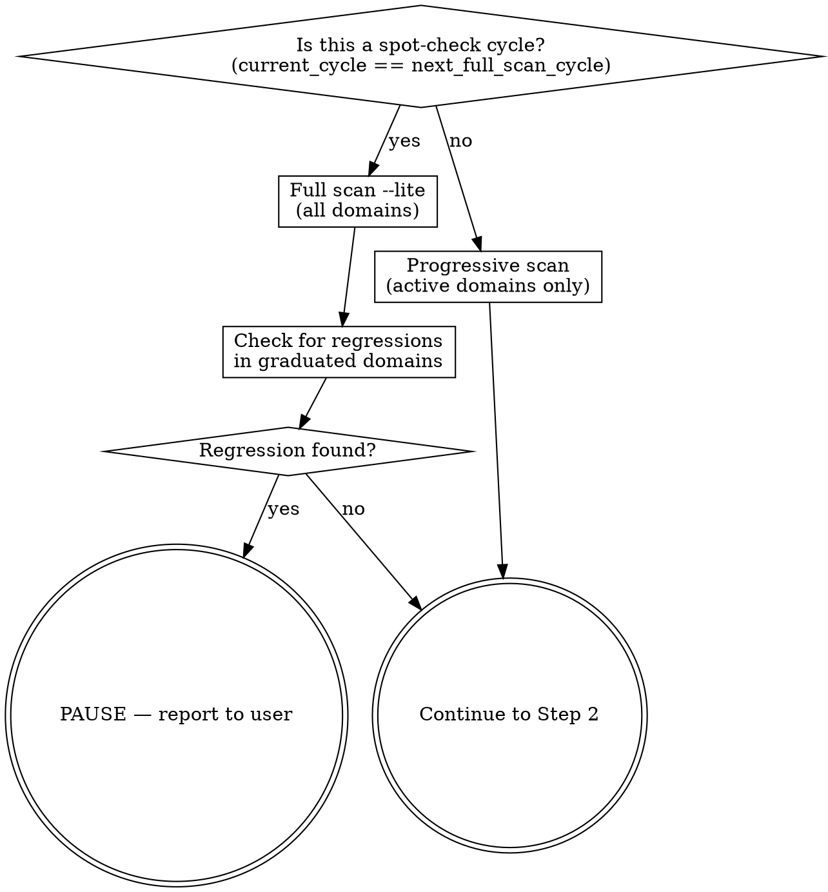

<!-- SYNC: hub-loop depends on hub-scan dimensions, hub-fix strategy
     levels, and hub-fix --autonomous/--skip-rescan flags.
     Update if any of these change. -->

# Hub Loop

**Announce at start:** "Running /hub-loop — autonomous quality grinder targeting grade A on all domains."

## Overview

Fully autonomous loop: scan → fix → re-scan → repeat until every domain reaches
grade A. Escalates strategy per domain (simple → aggressive → rewrite). Detects
plateaus and skips stuck domains. Persists state to `docs/hub-loop-state.json`
so any agent can resume after context limits.

Combines `/hub-scan` (diagnostic) and `/hub-fix` (correction) in a loop
inspired by autoresearch's autonomous experiment pattern.

## Pre-flight

### Resume check

```bash
# Check for --fresh flag (user wants to start over)
# Check for existing state file
if [ "$1" = "--fresh" ]; then
  rm -f docs/hub-loop-state.json
  echo "NEW"
elif [ -f "docs/hub-loop-state.json" ]; then
  echo "RESUME_CANDIDATE"
else
  echo "NEW"
fi
```

**If RESUME_CANDIDATE:** read the state file and apply these checks in order:

1. **Completed loop detection:** If ALL domains have status `graduated` or
   `needs_human`, the previous loop finished. Delete the state file and treat
   as NEW:
   > "Previous loop completed (all domains resolved). Starting fresh scan."

2. **Stale state detection:** Compare `started` date to today. If the state
   is older than 24 hours, ask the user:
   > "Found state from {date} ({N} days ago) with {M} active domains.
   > Resume that loop or start fresh? (resume/fresh)"
   - If user says **fresh** → delete state file, treat as NEW.
   - If user says **resume** → proceed with resume.

3. **Active loop resume:** If the state is recent (<24h) and has active domains,
   resume silently. Identify active domains (status not `graduated` or
   `needs_human`). Skip to the Loop phase, continuing from `current_cycle + 1`.

**If NEW:** proceed with initialization.

**User flag:** `--fresh` forces a clean start, deleting any existing state file
without prompting.

### Initialize

Check for dirty state before creating branch:
```bash
# Verify no uncommitted changes
if [ -n "$(git status --porcelain)" ]; then
  echo "WARNING: uncommitted changes detected"
  git stash -m "hub-loop: stashed before starting"
fi
git checkout -b hub-loop/$(date +%Y-%m-%d) 2>/dev/null || git checkout hub-loop/$(date +%Y-%m-%d)
```

Create initial state:

```json
{
  "started": "YYYY-MM-DD",
  "target_grade": "A",
  "max_cycles_per_domain": 5,
  "current_cycle": 0,
  "domains": {},
  "dead_ends": [],
  "last_full_scan_cycle": 0,
  "next_full_scan_cycle": 1
}
```

Save to `docs/hub-loop-state.json`.

## Cycle 1: Initial Full Scan

Run `/hub-scan` (full repo). This populates `docs/QUALITY_SCORE.md` and
`docs/quality-score.json`.

After scan, populate state domains from the JSON:

```json
{
  "domain_name": {
    "start_grade": "<grade from scan>",
    "current_grade": "<grade from scan>",
    "status": "graduated|active",
    "cycles_completed": 0,
    "strategy": "simple",
    "history": ["<initial grade>"]
  }
}
```

Domains already at A get `"status": "graduated"` immediately.

Commit state:
```bash
git add docs/hub-loop-state.json
git commit -m "chore(hub-loop): initialize state (cycle 1 scan)"
```

If all domains are A, skip to Final Report.

## Loop

**LOOP AUTONOMOUSLY.** Never ask "should I continue?" — run until a stop condition.

For each cycle:

### Step 1: Select domains to scan



- **Normal cycle:** `/hub-scan <active-domain-1> <active-domain-2> ...`
- **Spot-check cycle** (every 3 cycles): `/hub-scan --lite` (full, grades only).
  Update `last_full_scan_cycle` and `next_full_scan_cycle = current + 3`.

If spot-check finds a graduated domain dropped below A:
> "Regression detected: <domain> dropped from A to <grade>. Likely caused by
> cross-domain coupling from recent fixes. Pausing for review."
> **STOP.**

### Step 2: Evaluate

Read updated `docs/quality-score.json`. For each active domain:
- Update `current_grade` in state
- If grade is now A → set `status: "graduated"`, append grade to history
- If grade unchanged for 2 consecutive cycles → set `status: "needs_human"`,
  add explanation to `dead_ends`
- If 3+ fixes were reverted in the hub-fix cycle → set `status: "needs_human"`

**Check stop conditions:**
1. All domains graduated → Final Report (success)
2. All domains graduated or needs_human → Final Report (partial)
3. No active domains remain → Final Report

### Step 3: Prioritize

Sort active domains by:
1. Worst grade first (F before D before C before B)
2. Within same grade, security findings first
3. Within same priority, fewer cycles completed first (fresh domains)

### Step 4: Select strategy per domain

| Domain cycles completed | Strategy | Passed to hub-fix |
|------------------------|----------|----------------------|
| 0-1 | `--strategy=simple` | Atomic fixes only: tokens, aria, validation, lint, characterization tests |
| 2-3 | `--strategy=aggressive` | Structural refactors: extract class/service, split components, patterns, DI |
| 4 | `--strategy=rewrite` | Partial module rewrites preserving public interfaces. TDD rewrite. |

Update `strategy` in domain state.

### Step 5: Fix

Run `/hub-fix <domain> --strategy=<level> --skip-rescan --autonomous`
for each active domain, in priority order.

Flags explained:
- `--strategy=<level>`: controls fix aggressiveness (from Step 4)
- `--skip-rescan`: hub-loop manages its own scan cycles (avoids double scan)
- `--autonomous`: suppresses "3 reverts → STOP" — logs and continues instead

hub-fix runs its full process: plan → baseline → fix cycle → gate.

### Step 6: Update state and commit

After all fixes in this cycle:

```bash
# Update state file with new grades, statuses, histories
# Increment current_cycle

git add docs/hub-loop-state.json docs/QUALITY_SCORE.md docs/quality-score.json
git commit -m "chore(hub-loop): cycle N complete (<summary>)"
```

Summary format: `"3 domains active, users C→B, billing D→D (plateau)"`

### Step 7: Loop or stop

If active domains remain → go to Step 1 (next cycle).
If no active domains → Final Report.

## Final Report

```
hub-loop: complete
  Cycles: N
  Branch: hub-loop/YYYY-MM-DD

  Results:
  | Domain | Start | End | Cycles | Status |
  |--------|-------|-----|--------|--------|
  | <domain> | <start_grade> | <current_grade> | <cycles> | <status> |

  Dead ends (needs human):
  - <domain>: <explanation>

  Overall: <start_overall> → <end_overall>
```

If all domains A:
> "All domains at grade A. Run `/hub-scan` anytime to verify."

If partial:
> "Some domains need human intervention. See dead ends above.
> You can address these manually and run `/hub-loop` again to re-evaluate."

## Important Rules

- **Never stop to ask.** This is fully autonomous. The only pauses are: spot-check regression, and stale state prompt (>24h old).
- **Completed loops don't block new ones.** If all domains are resolved, the state file is deleted and a fresh loop starts automatically.
- **State is sacred.** Commit `docs/hub-loop-state.json` after every cycle. An agent crash must not lose progress.
- **Escalate, don't thrash.** Same strategy failing twice → escalate to next level. Don't retry the same approach.
- **Graduated means done.** Once a domain hits A, don't touch it unless a spot-check detects regression.
- **Dead ends are knowledge.** Always log what didn't work in `dead_ends` so future agents (or humans) know what was tried.
- **Max 5 cycles per domain.** Hard cap. After 5 cycles, the domain is either A or needs_human. No exceptions.
- **Full test suite gate.** Inherited from hub-fix. Every fix in every cycle must pass the full suite against baseline.
- **Use hub-fix flags.** Always pass `--skip-rescan --autonomous` to hub-fix. Scans are loop's responsibility. Stopping is loop's decision.
- **Lite mode for spot-checks.** Use `/hub-scan --lite` for spot-check cycles to save tokens. Full scan only for cycle 1 and final verification.
